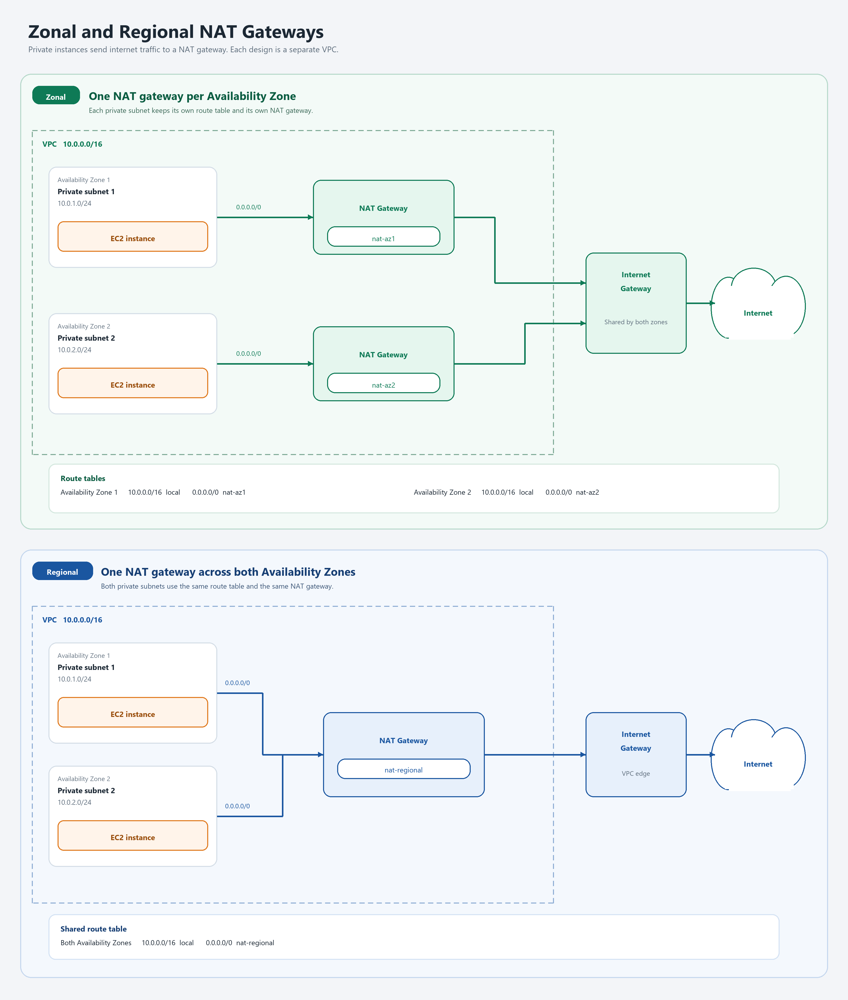

# AWS Zonal and Regional NAT Gateways

Terraform configurations for two AWS VPC designs that give private workloads outbound internet access. Each design is a separate stack and a separate VPC (`10.0.0.0/16`). Deploy one directory at a time.

| Design | NAT gateways | Route tables | Failure domain |
| --- | --- | --- | --- |
| [Zonal](Zonal/) | One public NAT gateway in each Availability Zone | Each private subnet has its own route table | An Availability Zone failure does not remove outbound access from the other zone |
| [Regional](Regional/) | One regional NAT gateway for the VPC | Both private subnets share one route table | AWS expands the gateway across Availability Zones as workloads appear |

## Architecture



Both stacks use the first two opted-in Availability Zones in the selected region. The default region is `us-east-1`.

Private instances have no public IP addresses. Internet-bound traffic follows `0.0.0.0/0` to a NAT gateway, and return traffic enters through the internet gateway. AWS creates the VPC local route (`10.0.0.0/16` to `local`) on every route table, so that route is not declared in Terraform.

### Zonal

Each Availability Zone has its own NAT gateway, Elastic IP, public subnet, private subnet, and private route table.

| Availability Zone | Public subnet | Private subnet | NAT gateway | Default route |
| --- | --- | --- | --- | --- |
| First zone | `10.0.101.0/24` | `10.0.1.0/24` | `nat-az1` | `0.0.0.0/0` to `nat-az1` |
| Second zone | `10.0.102.0/24` | `10.0.2.0/24` | `nat-az2` | `0.0.0.0/0` to `nat-az2` |

A zonal public NAT gateway must be placed in a public subnet, so each zone includes one. That subnet's route table sends `0.0.0.0/0` to the internet gateway.

### Regional

One NAT gateway is created with `availability_mode = "regional"`. It is associated with the VPC, not with a subnet, and AWS allocates addresses as the gateway expands. Both private subnets use the same route table.

| Availability Zone | Private subnet | Default route |
| --- | --- | --- |
| First zone | `10.0.1.0/24` | `0.0.0.0/0` to `nat-regional` |
| Second zone | `10.0.2.0/24` | `0.0.0.0/0` to `nat-regional` |

## Repository layout

Each AWS resource has its own `.tf` file. Resources that belong to one Availability Zone live in `az1/` or `az2/` and are called as Terraform modules.

```text
Zonal/
  vpc.tf
  internet_gateway.tf
  public_route_table.tf
  az1/    nat-az1, public subnet, private subnet 1, EC2
  az2/    nat-az2, public subnet, private subnet 2, EC2
Regional/
  vpc.tf
  internet_gateway.tf
  nat_gateway.tf
  private_route_table.tf
  az1/    private subnet 1, EC2
  az2/    private subnet 2, EC2
```

Each private subnet contains one Amazon Linux 2023 instance (`t3.micro`) with a security group that allows outbound traffic only.

## Requirements

- Terraform 1.5.0 or newer
- AWS provider 6.40.0 or newer (this repository locks 6.66.0)
- AWS credentials with permission to create VPC, EC2, and NAT gateway resources
- A region with at least two Availability Zones

## Deploy

```powershell
cd Zonal
terraform init
terraform apply
```

```powershell
cd Regional
terraform init
terraform apply
```

Override the region by passing `aws_region`, for example `terraform apply -var="aws_region=us-west-2"`.

Remove a stack with `terraform destroy` from the same directory. NAT gateways are billed hourly and for data processed, so destroy a stack when you are finished with it.
